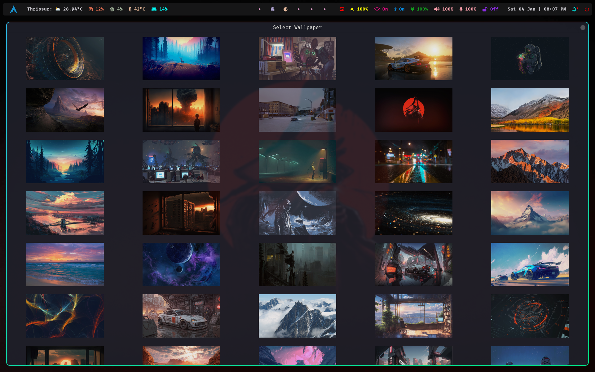

# Hyprland Dotfiles

<h2 align="center">

Personal [Hyprland](https://github.com/hyprwm/Hyprland) Dotfiles.

I use [Arch](https://archlinux.org) BTW.

</h2>

<h3 align="center">
	Waybar 
</h3>

<h3 align="center">
	 Rofi (Menu)
</h3>

<h3 align="center">
	 Wallpaper Selector (Custom)
</h3>

<h3 align="center">
	 Notifications
</h3>

<h3 align="center">
	 Rofi (WiFi)
</h3>

<h3 align="center">
	 Rofi (Power Menu)
</h3>

