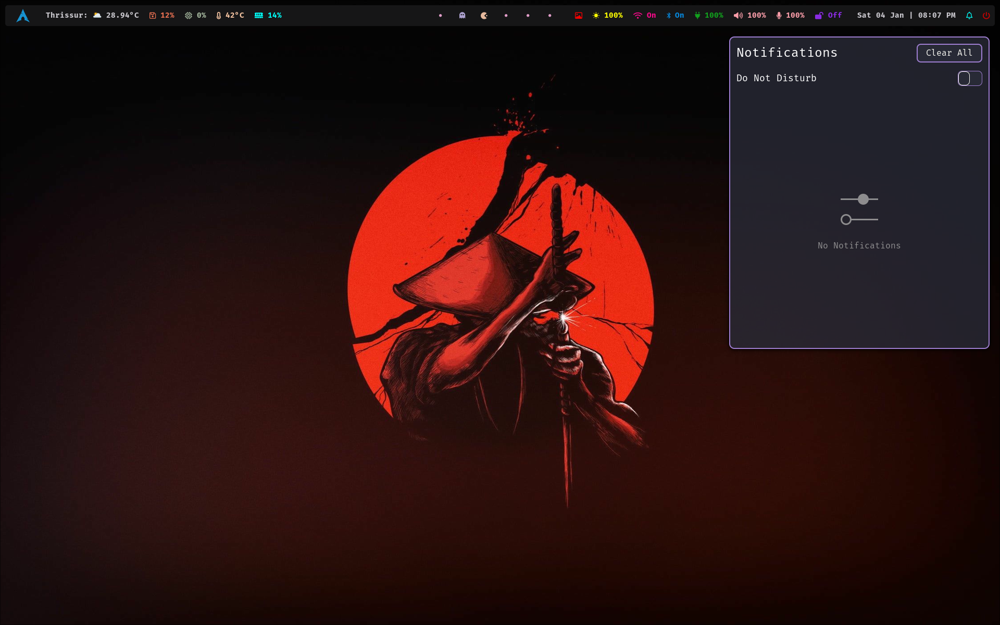

# Hyprland Dotfiles

Personal [Hyprland](https://github.com/hyprwm/Hyprland) Dotfiles.

I use [Arch](https://archlinux.org) BTW.

# Waybar

# Rofi (Menu)

# Wallpaper Selector (Custom)

# Notifications

# Rofi (WiFi)

# Rofi (Power Menu)

